# Configuracion-Red

## 1. Creamos dos máquinas virtuales

  - Usando la opción de clonación enlazada creamos dos máquinas a las cuales tenemos que modificar la MAC.

    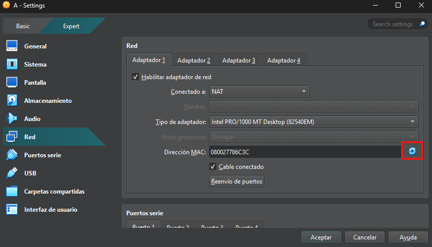

  - En la misma configuración de red de VirtualBox, el segundo adaptador de las dos máquinas lo habilitamos y lo ponemos en red interna.

    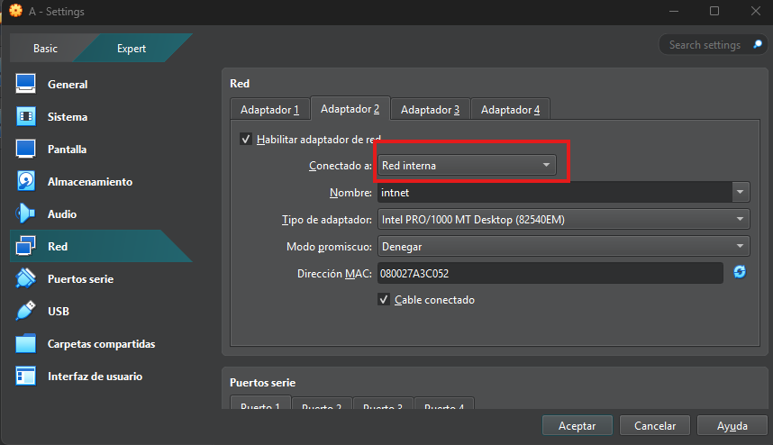

## 2. Configuración de red `enp0s8` temporal

  **Máquina A:** `192.168.100.2`

  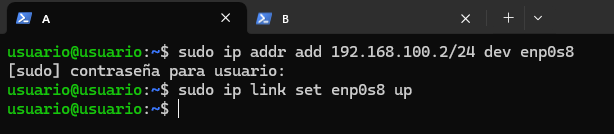

  **Máquina B:** `192.168.100.3`

  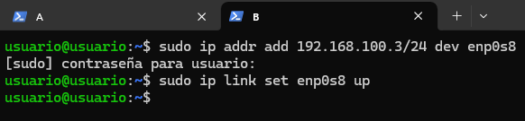

## 3. Comprobación de ping entre máquinas

  **Máquina A**

  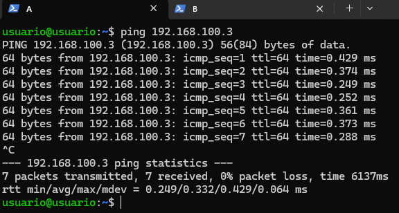

  **Máquina B**

   

## 4. Configuración de red permanente

  - Primeramente hacemos la copia del archivo `.yaml` para tener la plantilla.

    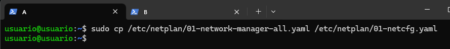

  - Editamos el archivo de configuración

    **Máquina A**

    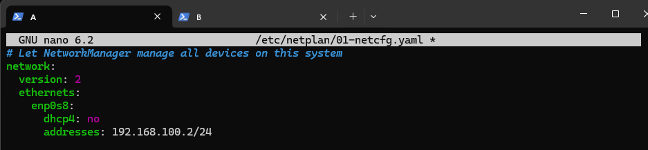

  - La máquina B se hace a través de networkManager

    **Máquina A**
     Primero configuraremos NetworkManager para que esté activado y cargue su configuración
    Cambiamos la línea:
    Cambiamos false por true

    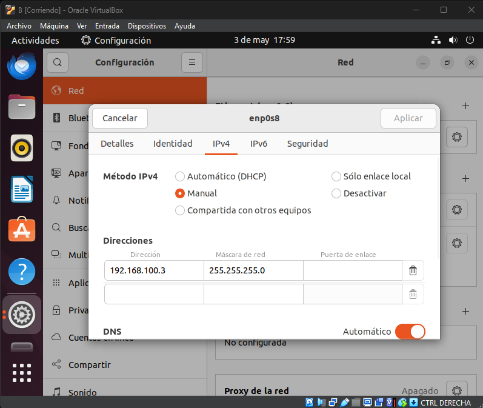

    Creamos el archivo de la interfás de red
    
    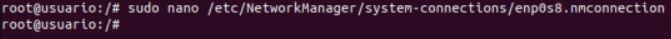

    Escribimos la configuración IP

    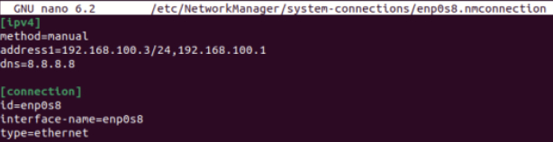

    Ejecutamos el comando <nmcli connection up ‘enp0s8’> para aplicarla

    Y comprobamos con el comando ip -c a
    
    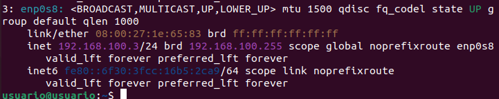
